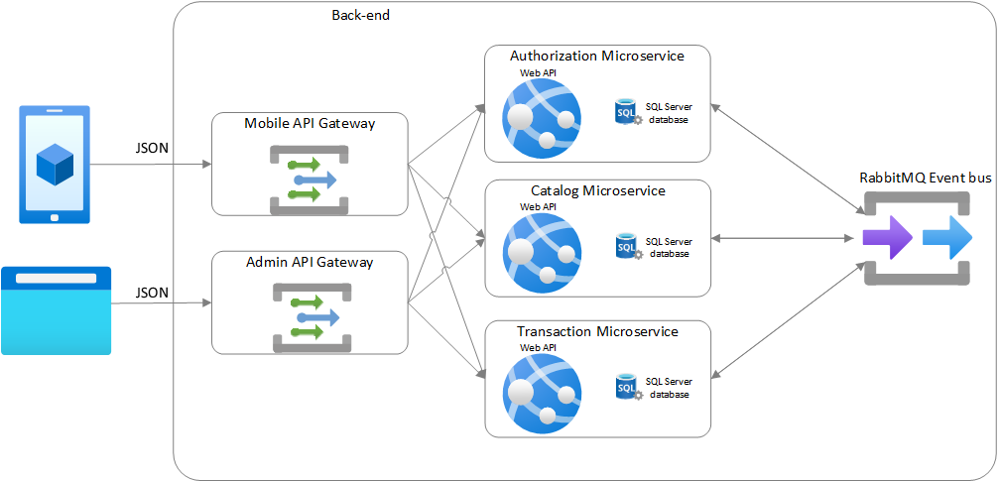

# StreetOfThings

## Introduction
StreetOfThings is an application have functionality similar to [Street bank](https://www.streetbank.com/), although the app provide interesting functionality, the main focus when building this app was not delivering value to users, the main focus was building portfolios and improve architecting skills.

This repository is only the `back-end` for StreetOfThings.

## Technologies in the back-end
* [.NET core 3.1](https://dotnet.microsoft.com/download/dotnet-core/3.1)
* [Identity server 4](https://identityserver4.readthedocs.io/en/latest/)  Identity and Access Control solution for .NET.
* [Docker](https://www.docker.com/) to create, deploy, and run applications by using containers.
* [gRPC](https://grpc.io/): A high-performance, open source universal RPC framework.
* [RabbitMq](https://www.rabbitmq.com/): message broker.
* [MediatR](https://github.com/jbogard/MediatR): Simple mediator implementation in .NET
* [Entity framework core](https://docs.microsoft.com/en-us/ef/core/): lightweight, extensible, open source and cross-platform version of the popular Entity Framework data access technology. 
* [FluentValidation](https://github.com/FluentValidation/FluentValidation)
* [Serilog](https://github.com/serilog/serilog): diagnostic logging library for .NET applications.
* [Swagger](https://swagger.io/): Simplify API developmen
* [Ocelot](https://github.com/ThreeMammals/Ocelot): Ocelot is a .NET API Gateway.

## Microservice
Microservice| Architecture | Description| Cool 
---|---|---|---
Authorization | N-Layer Architecture | Identity management service, powered by OAuth2 and OpendID connect | dfa
Catalog | [Clean Architecture](https://blog.cleancoder.com/uncle-bob/2012/08/13/the-clean-architecture.html) | Manages the user offerings | df
Transaction | [Clean Architecture](https://blog.cleancoder.com/uncle-bob/2012/08/13/the-clean-architecture.html), [CQRS](https://martinfowler.com/bliki/CQRS.html#:~:text=CQRS%20stands%20for%20Command%20Query,you%20use%20to%20read%20information) | Keep track of transactions between users | dfd 
Mobile gateway| |Provide aggrigation services & gateway for the mobile application. |
Admin gateway | | Provide aggrigation services & gateway for the anguler dashboard. |

